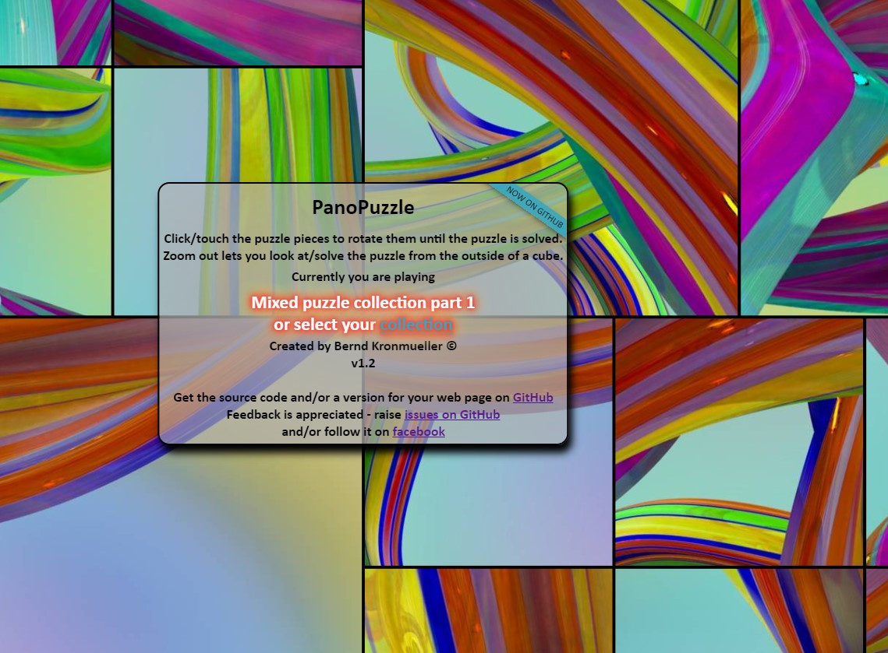
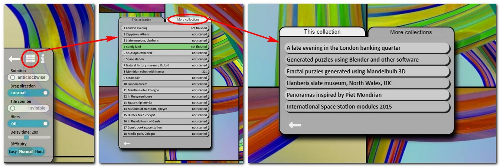

# PanoPuzzle

<br>
A 360 panoramic puzzle game - create longer interactions with your 360 images
<br><br>
The game subdivides the cubefaces of a 360 panorama and rotates some of them.<br> 
It is your job to find and rotate all the wrongly rotated ones and restore the 360 panorama to it's original glory.

<br><br><br><br><br><br>
When starting the game it will look like this
<br>
This gives you all the information you need to play the game - just look around by dragging the panoramic image with the finger/mouse or move your mobile device around and click/tap on a tile to rotate it until all the tiles are pointing in the right direction.<br>
Some settings can be changed, puzzles can be selected directly and puzzle categories can be changed by clicking/tapping the settings cog-icon at the bottom left of the screen which will open up a small settings panel.
<br>
The game also allows you to zoom out and solve the puzzle looking at the cube from the outside, a tile counter can be en/disabled to make it easier/harder and you can share a specific puzzle via the share button on the bottom right.
<br>


## Getting PanoPuzzle for your own web site

### Getting the code

Go here to download the <a href="https://github.com/kronpano/PanoPuzzle/releases/latest">latest release</a> as a zip file.<br>
When you unzip it it will create the directory structure with all the include/css/webfont files needed.<br>
The main directory contains the 3 html files described in the ReadMe under <a href="https://github.com/kronpano/PanoPuzzle#live-examples">live examples</a> - one collection, multiple collections, grid demo.<br>
Those files use their respective config files in the include folder<br>
So all you need to do is copy one of the config files - make a copy - adjust the content for your puzzle<br>
That means point them to the correct image directories and fill in all the information required (described in the ReadMe)<br>
Also - create the cube face images for the puzzles and put them in the directories - as described below<br>

You can always just get the whole thing as a zip file - the directory structure needs to be observed!!

### Preparing the panoramic images
The directory is the path relative to the images directory

```bash
├───images
   ├───collection2
   │   ├───pano1
   │   │       back.jpg
   │   │       bottom.jpg
   │   │       front.jpg
   │   │       left.jpg
   │   │       right.jpg
   │   │       top.jpg
   │   │
   │   └───pano2
   │           back.jpg
   │           bottom.jpg
   │           front.jpg
   │           left.jpg
   │           right.jpg
   │           top.jpg
   │
   ├───pano1
   │       back.jpg
   │       bottom.jpg
   │       front.jpg
   │       left.jpg
   │       right.jpg
   │       top.jpg
   │
   └───pano2
           back.jpg
           bottom.jpg
           front.jpg
           left.jpg
           right.jpg
           top.jpg
```

In the directory (e.g. pano1) the script expects the cube faces named back.jpg, bottom.jpg, front.jpg, left.jpg, right.jpg and top.jpg as you can see in the directory tree above. The directories are specified in the <a href="https://github.com/kronpano/PanoPuzzle/blob/main/README.md#creating-and-changing-the-configuration-file">configuration file</a> 

Please create the cube faces so that they are sized to a power of 2 e.g. 1024x1024 or 2048x2048
This will prevent the script from complaining (warnings) that the texture is not a power of 2

I use PTGui to make this conversion - this allows to set the size and jpg compression - smaller files load quicker BUT you might get compression artifacts

There are also free online services you can use to convert an equirectangular image to cube faces like<br>
https://360toolkit.co/convert-spherical-equirectangular-to-cubemap<br>
or<br>
https://jaxry.github.io/panorama-to-cubemap/<br>
and free tools for download (windows)<br>
https://pragmar.com/qbit/

This conversion could be implemented in javascript as well but it would need to run every time again to convert an equirectangular input to cubemap images.
Doing it in javascript means it would use the device for the conversion which takes time/proessing power...

Doing it "offline" also gives the user the possibility to choose a jpg compression which makes the image files small enough but doesn't leave too many compression artifacts. I usually end up using a compression between 50-70 - using a higher compression for 2048x2048 files to shrink them a bit more.

### Creating and changing the configuration file

--- Still working on it<br>
The example configuration files like <a href="include/PanoPuzzle_config_1.js">PanoPuzzle_config_1.js</a> have a comment section at the start and a descriptiopn of all the grid patterns at the end but a better explanation will follow soon.

The configuration file is divided into a couple of sections:<br>
- head<br>
  the head contains the following code and is the same no matter if you have a config with one or many collections
  ```
  // this is the first .js file to be included in the HTML so I need to define it here
  // because a multi collection puzzle might need this value
  // this value should not be changed or PanoPuzzle might not work any more properly
  const baseURL = window.location.href.split("?")[0];

  // needed to make it possible to run several puzzle games on the same URL with different settings...
  // this name is used as a post-fix of the local storage values of a game - if two puzzle games are run
  // under the same URL with the same ConfigName - there will be a problem!!
  const ConfigName ="OneCollection"
  
  // which configuration to read for the current puzzle collection
  // if you point to the main URL e.g. panopuzzle.created-by.me without any additional parameters
  // the whichDefaultConfig variable will determine which part of PP_config will be used as the default
  // So if you add a whole new collection and want people to see it add it in PP_config and change the default value here
  const whichDefaultConfig = "demo_1";   //possible values come out of the PP_config variable 
  
  // time in ms the info stays before before hiding by itself
  const infoTime = 15000;
  
  // percentage of tiles shuffeld on easy or hard
  // to check the end blurbs after the puzzles are finished (defined in PP_config) I set the easy value to 0
  // this reports a wrong time for solving the puzzle but you don't have to play it - it will be solved
  const panoShuffleEasy = 10;
  const panoShuffleHard = 90;

  // percentage of normal shuffle rate is pecified in PP_config for each panorama individually
  ```
- PP definition (PP for PanoPuzzle)<br>
  This part is different for PanoPuzzles with one or more than one collection.
  <br><br>
  A configuration with only one collection basically defines the info variable which is shown at the start of the game or when you click the i in the settings panel. The variable contains HTML formatted text which can be styled using CSS.<br>
  Because it is a multi-line variable definition it needs to be enclosed in ` (back ticks) so you need to be careful if you want to use any back-ticks in your HTML.
  The basic format is
  ```
  PP = { 
  "InfoLinks":{
        "info":`
                multi line
                HTML variable with formatting
        `
        }
  }
  ```
  check out <a href="include/PanoPuzzle_config_1.js">PanoPuzzle_config_1.js</a> as an example
  <br><br>
  A configuration with multiple collections defines the info variable as well but in addition it will have descriptions and links to the other collections. The collections are defined furher down in PP_config but the text that will appear in the "More collections" tab and the links and tooltips are defined here.
  <br>
  The basic format is
  ```
   PP = { 
   "InfoLinks":{
        "info":`
                multi line
                HTML variable with formatting
        `,  //so far the same -- definition of info and now the additional values - don't forget the , after the `
        "links":{
                "maze":{                                        // config name - needs to be defined in PP_config
                        title:"A puzzle of a maze",             // tooltip when hovering over that collection
                        href:baseURL+"?config=maze&pano=2",     // the link to that collection + which pano to start
                        text:"Maze Puzzle plain"                // the text in the "More collections" tab
                },
                "grid":{                                         // config name - needs to be defined in PP_config
                        title:"Shows the build-in grid patterns", 
                        href:baseURL+"?config=grid",            // if no pano is given a random panorama in the first half
                                                                // of the list will be selected by the javascript 
                        text:"Grid demo - shows build-in grid patterns of PanoPuzzle"
                }, 			 
                "ColouredMazeNames":{                           // config name - needs to be defined in PP_config
                        title:"Coloured maze with names", 
                        href:baseURL+"?config=ColouredMazeNames",
                        text:"Coloured maze with names different subdirectory"
                }
        },
        // here you define which of the links above will be shown for a certain configuration
        // if you have several collections and you do not want all the other collections to show up
        // for everything you can select which ones to show - or show them all	
        "maze_Links":[                                          // this name is a config name defined in PP_config
                                                                // followed by "_Links" 
                "grid","ColouredMazeNames","ColouredMaze"       // all those names need to be defined in PP_config
        ],
        "grid_Links":[
                "maze","ColouredMazeNames","ColouredMaze"
        ],
        "ColouredMazeNames_Links":[
                "maze","grid","ColouredMaze"
        ],
        "ColouredMaze_Links":[
                "maze","grid","ColouredMazeNames"
        ]        
        }
  }
  ```
  check out <a href="include/PanoPuzzle_config_2.js">PanoPuzzle_config_2.js</a> as an example 
- PP_config<br>
  The PP_config variable contains all the information of which puzzles are in which collection and all their properties. <br>The basic format is:
  ```
  PP_config = { 
  "config-name-1" : [
		[version number, description, author, date created],        // info about config 1       
	 
		["some html text - include <class='txt'> so it can be shown in the overview of all puzzles",
        "pattern",
        "percent scrambled",
        "color of grid",
        "directory to find the cube faces",
        "unique id"
		],	
		:
		:
		["some html text - include <class='txt'> so it can be shown in the overview of all puzzles",
	 	"pattern","percent scrambled","color of grid","directory to find the cube faces","unique id"
		],
	], //<-- end bracked of first config
  "config-name-2" : [    // this is the second config 
		[version number, description, author, date created],       // info about config2
		["some html text - include <class='txt'> so it can be shown in the overview of all puzzles",
		 "pattern","percent scrambled","color of grid","directory to find the cube faces","unique id"
		],	
		:
		:
		["some html text - include <class='txt'> so it can be shown in the overview of all puzzles",
	 	"pattern","percent scrambled","color of grid","directory to find the cube faces","unique id"
		],
	]  	//<- end bracket config 2	
  } //<-- closing bracket for PP_config variable		
  ```
  - config-name<br> the name of the configuration used in PP definition to link to other collections
     - first element of this array (number 0) is used for description of this config
       - [
       - version number,<br> change that if you have changed a configuration to make sure the confiduration is re-read properly
       - description,<br> short HTML text which is used in info (defined in PP above) to replace the innerHTML of id='currentlyPlaying'   
       - author,<br> not really used
       - date<br> not really used
       - ],
    - from element 1 onwards we now have the parameters for the different puzzles
      - HTML description and end blurb <br>the HTML part with the class='txt' is extracted and used in the "This collection" selection table. The whole part is used as the end blurb when the puzzle is solved. Since it is HTML you can use all HTML elements and styles - just remember to keep it short - it should fit easily on a mobile screen.<br>
      You can have links in the blurb to link to external web sites
        ```
        ["<h3 class='txt'>Natural history museum, Oxford</h3>
        <h4>In a neo-gothic building this museum is free and has something for the whole family.</h4>
        <h5>Full virtual tour <a href='http://www.oum.ox.ac.uk/tour/tour.html' target='_blank'>here</a></h5"
        ,8,50,0xF7DC6F,"Dir5","PP1_5"
        ],
        ```
        and/or link to other collections
        ```
        ["<h3 class='txt'>London evening</h3><h4>Leadenhall quarter in the evening</h4>
          <h5>Full London night puzzle tour can be found <a href="+baseURL+"?config=LondonNight>here</a></h5",
          5,50,0xF7DC6F,"Dir1","PP1_1"
        ],	
        ```
      - pattern of the grid<br>
      there are 13 build in patterns which are described in the sample config files and there is the <a href="./PanoPuzzleGridDemo">grid demo</a> which shows all the implemented patterns
      - percent scrambled<br>
      percentage of wrongly rotated tiles when played in "normal" setting - for hard and easy the values are defined in the head of the config file.
      - color of the grid<br>
      color in "0xFF0000" format - you sometimes need to adjust the grid coulour so it is actually visible
      - directory<br>
      the path to the directory of the cube face images relative to images as described under <a href="https://github.com/kronpano/PanoPuzzle/blob/main/README.md#preparing-the-panoramic-images">preparing the panoramic images</a>
      - a unique ID<br>
      the unique ID is used when sharing a puzzle via a share button - this makes sure that even if the configuration of a puzzle has changed that the link still points to the correct puzzle. If you add new puzzles to a collection you might want to add them to the beginning to show them first - that means the array of the configuration has changed and puzzle 5 is now puzzle 6 so referencing it via ?config=configA&pano=5 would point to the wrong puzzle
      PanoPuzzle creates in internal lookup table that is used when a link in the ?uid=CMN_6 format comes in. <br>
      That UID will be translated to point to the correct puzzle.<br>
      My way of creating unique IDs is to just take the category name (in some abbreviated form) and add _\<number\> from the bottom to the top.

Errors in this file can mean that PanoPuzzle shows black tiles (can't find the image directories, wrongly defined colour...) which will only be shown in the console of the developer tools.<br>
<br>
Because that file is so important there is a ToDo point of writing a validator for this file so a user can see if everything points to the right places....


## live examples
### - the live <a href="https://panopuzzle.created-by.me">PanoPuzzle</a>
My PanoPuzzle web page - which started all of this can be seen under https://panopuzzle.created-by.me <br>
it consists of several collections with over 80 panorama puzzles at the moment

### - on GitHub to show a configuration with only one collection
https://kronpano.github.io/PanoPuzzle/PanoPuzzleOneCollection.html<br><br>
The configuration file has only one collection so there will be no possibility to change the collection.<br>
Using the <a href="include/PanoPuzzle_config_1.js">PanoPuzzle_config_1.js</a> config file in <a href="PanoPuzzleOneCollection.html">PanoPuzzleOneCollection.html</a> 

### - on GitHub to show a configuration with several collections
https://kronpano.github.io/PanoPuzzle/PanoPuzzleTwoCollection.html<br><br>
The configuration file has four collections so you can choose which collection you want to play.<br>
Using the <a href="include/PanoPuzzle_config_2.js">PanoPuzzle_config_2.js</a> config file in <a href="PanoPuzzleTwoCollection.html">PanoPuzzleTwoCollection.html</a> 
### - on GitHub to show all the build in subdivision patterns
https://kronpano.github.io/PanoPuzzle/PanoPuzzleGridDemo.html<br><br>
Using the <a href="include/PanoPuzzle_config_grid.js">PanoPuzzle_config_grid.js</a> config file called by <a href="PanoPuzzleGridDemo.html">PanoPuzzleGridDemo.html</a>  creates the web page which demonstrates the different built in grid patterns.


## ToDo
#### Configuration file validation
The configuration file is the heart and soul which contains all the information - a simple typo in there can mean everything works fine - EXCEPT for this one puzzle which will leave the screen blank because - the directory can not be found, the colour/pattern of the grid not defined because of a typo, .....
Thought it would be a good idea to have some sort of "Config file validator" which will create a html page which shows all the information and flags up potential errors.

#### Audio option
Thought it would be nice to have an audio option which will start playing information or music once a certain percentage of the puzzle is solved. Should be an optional entry in the config file.
